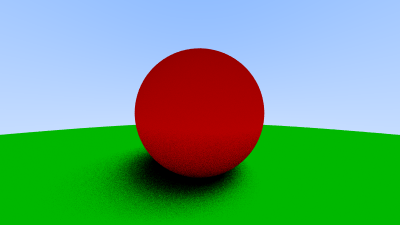
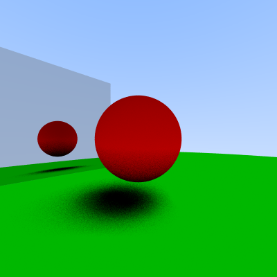
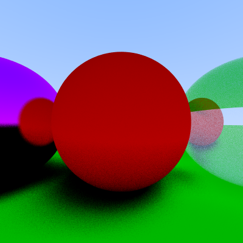
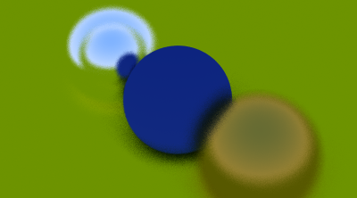

# `Ray Tracing em CUDA: implementação e comparação`
# `Ray Tracing in CUDA: implementation and comparison`

## Apresentação

O presente projeto foi originado no contexto das atividades da disciplina de pós-graduação *EA979A - Introdução a Computação Gráfica e Processamento de Imagens*, 
oferecida no primeiro semestre de 2022, na Unicamp, sob supervisão da Profa. Dra. Paula Dornhofer Paro Costa, do Departamento de Engenharia de Computação e Automação (DCA) da Faculdade de Engenharia Elétrica e de Computação (FEEC).

> |Nome  | RA | Curso|
> |--|--|--|
> | João Gabriel Segato Kruse  | 218615  | Eng. de Computação|

## Descrição do Projeto
Ray Tracing é uma técnica de computação gráfica que simula o trajeto de raios de luz para a renderização de imagens e é muito utilizada em uma variedade de algoritmos. Embora essa técnica consiga gerar imagens de muito boa qualidade, seu custo computacional é muito alto, necessitando de formas de otimizar sua execução. Uma das formas de fazer isso é através de APIs como a Nvidia CUDA, que foi projetada para a execução de códigos em paralelo e assim pode gerar uma grande aceleração desse processo. Assim, esse projeto tem como principal objetivo a implementação de um ray tracer com funcionalidades básicas utilizando CUDA e a posterior comparação de sua performance e imagens geradas com um ray tracer implementado usando apenas C++. Com isso, o projeto será composto das seguintes tarefas:
* Implementação de uma versão de ray tracer base em C++
* Implementação de uma versão de ray tracer usando CUDA para acelerar algumas das etapas
* Comparação da performance entre as implementações

### Ray Tracing
Ray Tracing é um dos métodos que podem ser usados em técnicas de renderização, e ele acaba tendo um trade-off de imagens com maior qualidade, mas com um custo computacional muito maior. Assim, essa técnica geralmente era mais utilizada para renderizações em filmes e imagens, que não exigiam uma excecução muita rápida, mas para outras mídias como jogos, nas quais a taxa de quadros por segundo gerados dinâmicamente é essencial, outros métodos precisavam ser aplicados. Esse maior custo inerente ao Ray Tracing vem do fato dele traçar o caminho de um feixe imaginário indo de um ponto de foco e passando por cada pixel da imagem e calculando a cor visível por ele. Assim, temos a capacidade de simular efeitos óticos como a reflexão, refração, dispersão, além de outros efeitos mais complexos como motion blur, depth of field, etc. Recentemente, uma nova linha de placas lançada pela Nvidia trouxe acelerações em hardware para tarefas relacionadas a Ray Tracing, possibilitando agora seu uso em aplicações mais dinâmicas como jogos.  
Em traços gerais, o que o algoritmo faz é simular um raio saindo de um ponto de foco e um pixel até alguma superfície que bloqueie seu caminho, o que dará sua cor. Vale notar que cada superfície possui características próprias, podendo refletir, refratar, dispersar, etc o raio chegando nela, e isso precisa ser levado em conta também. Realizando essa simulação para um conjunto suficientemente grande de raios passando por todos os pixels da imagem e posteriormente usando outros métodos de processamento de imagem para remover possíveis artefatos e aliasing, chegamos em uma imagem final renderizada.

### CUDA
Ray Tracing é uma técnica que permite paralelização de algumas de suas etapas, o que justifica o uso de linguagens e plataformas que possibilitem isso. CPUs são especialmente boas em processamentos sequenciais de dados, se especializando nisso com sua arquitetura, datapath e hierarquia de cache, mas para tarefas paralelizadas elas acabam não sendo ideais (elas possuem otimização na performance single-thread). Para esse tipo de projeto, GPUs podem ser mais apropriadas por seus designs e arquiteturas serem mais adaptados justamente a processamentos paralelos com seus milhares de "cores". Assim, foram desenvolvidas plataformas focadas no deselvolvimento de aplicações que usem a GPU, como é o exemplo da CUDA da Nvidia. CUDA é uma plataforma de computação paralela e modelo de programação criado para utilizar esse poder das "Unidades de Processamento Gráfico" e será usado nesse projeto com o objetivo de tentar acelerar o Ray Tracer.

### Comparação
Por fim, o projeto tem como objetivo a comparação da performance da implementação em C++ e em CUDA, tentando identificar os pontos de maior diferença entre os métodos e pontos nos quais ambas as técnicas não apresentam grandes diferenças, e justificar isso com base nos conhecimentos de arquitetura de computadores e do software e hardware utilizado.

## Plano de Trabalho
Para a realização desse trabalho as seguintes etapas serão necessárias:

---------------------------------------------- Entregável E1 --------------------------------------------------
  
* Etapa 1 (1 semana): Estudo do funcionamento de um Ray Tracer

>>> Inicialmente será necessário um estudo do funcionamento de um ray tracer e dos algoritmos necessários para sua implementação. A conclusão dessa etapa consiste no entendimento dos algoritmos necessários, suas funções e em como eles podem ser implementados.
      
* Etapa 2 (1 semana): Implementação do Ray Tracer em C++
 
>>> Implementação de um primeiro Ray Tracer utilizando apenas C++. A conclusão dessa etapa consiste em um código em C++ funcional que consiga gerar imagens utilizando Ray Tracing. Esse Ray Tracer seguirá as funcões básicas apresentadas no projeto em [1], mas caso sobre tempo nessa etapa pode ser expandido com novas features (como as apresentadas nos 'Next Steps' de [1]) ou para incluir alguns elementos introduzidos em [5] e [6].
    
* Etapa 3 (1 semana): Estudo do Nvidia CUDA
    
>>> Estudar e entender melhor o funcionamento do CUDA. A conclusão dessa etapa envolve uma compreensão mais aprofundada dos pontos e aplicações nos quais CUDA trará um benefício de desempenho, além de uma introdução a sua sintaxe e uso. Essa etapa também envolverá a configuração do ambiente necessária para a compilação dos códigos em CUDA. Esse Ray Tracer seguirá as funcões básicas apresentadas no projeto em [1] só que usando CUDA Caso sobre tempo nessa etapa pode ser expandido com novas features (como as apresentadas nos 'Next Steps' de [1]) ou para incluir alguns elementos introduzidos em [5] e [6].

* Etapa 4 (1 semana): Implementação do Ray Tracer usando CUDA

>>> Implementação de um segundo Ray Tracer utilizando CUDA. A conclusão dessa etapa consiste em um código usando CUDA funcional que consiga gerar imagens utilizando Ray Tracing. 
  
---------------------------------------------- Entregável E2 --------------------------------------------------
  
* Etapa 5 (1 semana): Testes e Comparação de Resultados
      
>>> Realização de testes de geração de imagens, medindo tempos de execução para que seja possível comparar a performance das diferentes implementações. A conclusão dessa etapa envolverá a geração de gráficos comparativos dos tempos de execução e análises dos principais pontos de diferença entre as implementações, tentando assim justificar os resultados obtidos.

* Etapa 6 (2 semanas): Preparação do Relatório e da Apresentação
  
>>> Escrita do relatório e preparação do material que será apresentado. A conclusão dessa etapa envolverá a preparação de um relatório delineando o projeto, sua implementação, resultados e conclusões; além de uma apresentação, que poderá ser no formato de slides ou algum outro formato expositivo, delineando os mesmo pontos.

* Extra (5 semanas): Tempo extra

>>> Tempo extra que poderá ser usado para complementar as outras etapas caso ocorram imprevistos. Caso "sobre tempo" o projeto pode ser expandido:  
    * Incluindo novas features nos Ray Tracers implementados;  
    * Realizando uma outra implementação em Python, por exemplo, para comparar a performance também;

  
---------------------------------------------- Entregável E3 --------------------------------------------------
  
## Resultados Parciais
Até o entregável 2, já foi implementado o código do ray tracer em C++, faltando para a conclusão do projeto apenas sua adaptação para que ele passe a usar CUDA também. Para a compilação dos códigos, foi utilizado o CMake, que gerará o Makefile automaticamente para nós. Além disso, para a geração de documentação automática está sendo usado o Doxygen, logo ele precisa ser instalado para que o CMake funcione. Com isso feito, basta criar uma pasta build no mesmo local onde está o CMakeFile.txt, e de dentro dela chamar o comando `cmake ../`, que gerará o arquivo que será usado para compilar o código, bastando usar o comando `make` para isso. Assim, teremos um conjunto de executáveis que foram criados para testar diversas funcionalidades, como a renderização de formas diferentes, de materiais diferentes, etc. Exemplos dessas imagens já foram salvos na pasta 'C++/images', e podem ser vistas abaixo. Para que não seja necessário recompilar o código sempre que desejemos renderizar uma cena diferente, foi criado também um arquivo de configuração no qual descrevemos a cena. Assim, o executável 'from_file_test' lê o arquivo 'config.scene' que precisa estar na pasta examples, e gera a imagem renderizada a partir dele.

## Referências Bibliográficas
[1] https://raytracing.github.io/books/RayTracingInOneWeekend.html  
[2] https://developer.nvidia.com/blog/accelerated-ray-tracing-cuda/  
[3] Pitkin, Thomas A.. “GPU ray tracing with CUDA.” (2013).  
[4] https://docs.nvidia.com/cuda/index.html
[5] https://raytracing.github.io/books/RayTracingTheNextWeek.html
[6] https://raytracing.github.io/books/RayTracingTheRestOfYourLife.html
