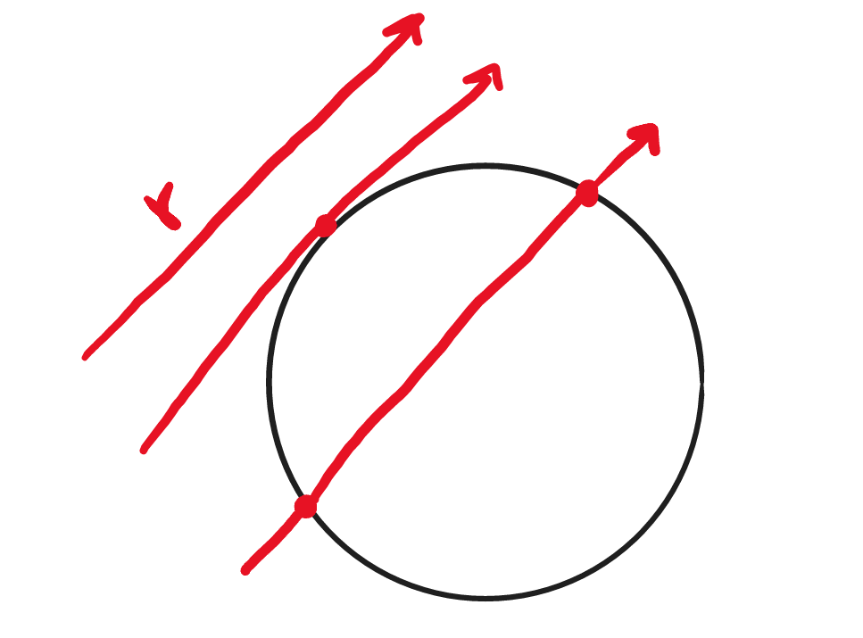

# `Ray Tracing em CUDA: implementação e comparação`
# `Ray Tracing in CUDA: implementation and comparison`

## Apresentação

O presente projeto foi originado no contexto das atividades da disciplina de graduação *EA979A - Introdução a Computação Gráfica e Processamento de Imagens*, oferecida no primeiro semestre de 2022, na Unicamp, sob supervisão da Profa. Dra. Paula Dornhofer Paro Costa, do Departamento de Engenharia de Computação e Automação (DCA) da Faculdade de Engenharia Elétrica e de Computação (FEEC).

> |Nome  | RA | Curso|
> |--|--|--|
> | João Gabriel Segato Kruse  | 218615  | Eng. de Computação|

## Resumo
&nbsp;&nbsp;&nbsp;&nbsp;&nbsp;&nbsp;Foi desenvolvido um Ray Tracer contendo funcionalidades básicas, possuindo esferas e planos como objetos básicos, e materiais que podem emitir luz, refletir a luz tanto difusamente quanto não difusamente e refratar a luz. As implementações foram feitas em C++ puro e usando aceleração em CUDA para paralelizar o código e foi visto um ganho de performance no qual o CUDA foi mais de 100 vezes mais rápido para a maioria dos testes. Como nenhuma das implementações foi feita da forma mais otimizada e nem possui todas as features que um ray tracer comercial teria, essa comparação não mostra a real diferença entre os métodos, mas ainda assim já dá uma ideia das vantagens que podem ser obtidas. Algumas implementações fuuras que faltaram seria o uso de texturas nas imagens entre outras etapas.

## 1. Descrição do Projeto
&nbsp;&nbsp;&nbsp;&nbsp;&nbsp;&nbsp;Ray Tracing é uma técnica de computação gráfica que simula o trajeto de raios de luz para a renderização de imagens e é muito utilizada em uma variedade de algoritmos. Embora essa técnica consiga gerar imagens de muito boa qualidade, seu custo computacional é muito alto, necessitando de formas de otimizar sua execução. Uma das formas de fazer isso é através de APIs como a Nvidia CUDA, que foi projetada para a execução de códigos em paralelo e assim pode gerar uma grande aceleração desse processo. Assim, esse projeto tem como principal objetivo a implementação de um ray tracer com funcionalidades básicas utilizando CUDA e a posterior comparação de sua performance e imagens geradas com um ray tracer implementado usando apenas C++. Com isso, o projeto será composto das seguintes tarefas:
* Implementação de uma versão de ray tracer base em C++
* Implementação de uma versão de ray tracer usando CUDA para acelerar algumas das etapas
* Comparação da performance entre as implementações

## 2. Ray Tracing
&nbsp;&nbsp;&nbsp;&nbsp;&nbsp;&nbsp;Ray Tracing é um dos métodos que podem ser usados em técnicas de renderização, e ele acaba tendo um trade-off de imagens com maior qualidade, mas com um custo computacional muito maior. Assim, essa técnica geralmente era mais utilizada para renderizações em filmes e imagens, que não exigiam uma excecução muita rápida, mas para outras mídias como jogos, nas quais a taxa de quadros por segundo gerados dinâmicamente é essencial, outros métodos precisavam ser aplicados. Quando estamos renderizando uma imagem, o que nós estamos buscando na verdade é uma projeção da nossa cena 3D em um plano 2D, o que pode ser feito de diversas maneiras dependendo da técnica empregada.

<p align="center"><b>Fig.1 - Projeção da Cena em um plano</b></p>

&nbsp;&nbsp;&nbsp;&nbsp;&nbsp;&nbsp;Quando trabalhamos com Ray Tracing, o maior custo computacional inerente à técnica vem justamente do fato dele, para fazer essa projeção, traçar o caminho de um feixe imaginário partindo de um ponto de foco e passando por cada pixel da imagem e calculando a cor visível por ele. Assim, é necessário simular efeitos óticos como a reflexão, refração, dispersão, além de outros efeitos mais complexos como motion blur, depth of field, etc. A vantagem desse método é que, por conta de todos esses efeitos estarem sendo levados em conta para a obtenção da imagem, ela acaba podendo ser mais realista. 

 
<p align="center"><b>Fig.2 - Exemplo de raio</b></p>

&nbsp;&nbsp;&nbsp;&nbsp;&nbsp;&nbsp;Recentemente, uma nova linha de placas lançada pela Nvidia trouxe acelerações em hardware para tarefas relacionadas a Ray Tracing, possibilitando agora seu uso em aplicações mais dinâmicas como jogos.  
&nbsp;&nbsp;&nbsp;&nbsp;&nbsp;&nbsp;Em traços gerais, o que o algoritmo faz é simular um raio saindo de um ponto de foco e um pixel até alguma superfície que bloqueie seu caminho, o que dará sua cor. Vale notar que cada superfície possui características próprias, podendo refletir, refratar, dispersar, etc o raio chegando nela, e isso precisa ser levado em conta também. Realizando essa simulação para um conjunto suficientemente grande de raios passando por todos os pixels da imagem e posteriormente usando outros métodos de processamento de imagem para remover possíveis artefatos e aliasing, chegamos em uma imagem final renderizada.  
&nbsp;&nbsp;&nbsp;&nbsp;&nbsp;&nbsp;Agora vamos entrar em mais detalhes de cada etapa para a implentação de um Ray Tracer. 

### Câmera
&nbsp;&nbsp;&nbsp;&nbsp;&nbsp;&nbsp;É muito comum quando trabalhando com computação gráfica que a representação virtual da câmera seja fixa na posição (0,0,0) e que todas as operações relacionadas ao seu posicionamento e outros parâmetros seja na verdade aplicada na cena, de modo que um efeito equivalente seja obtido mantendo a câmera no mesmo local. Embora isso seja a práica mais comum, por fins de simplicidade e para facilitar o entendimento foi optado por mover e aplicar esse tipo de operações no próprio objeto da câmera realmente.
&nbsp;&nbsp;&nbsp;&nbsp;&nbsp;&nbsp;Dessa forma, nosso objeto de câmera possui uma posição e 2 vetores principais perpendicular cujo produto vetorial nos indica a direção para a qual a câmera está apontada. Podemos ainda definir o field of view (FOV) da câmera correspondendo ao ângulo $\theta$ de abertura. Na implementação aqui feita foi optado por derivar esses parâmetros a partir do ponto de origem (posição da câmera), ponto central de onde se deseja olhar, ângulo de abertura e aspect ratio.

 
<p align="center"><b>Fig.3 - Câmera com alguns de seus principais atributos</b></p>

### Criando os Raios
&nbsp;&nbsp;&nbsp;&nbsp;&nbsp;&nbsp;Como vimos anteriormente, precisamos gerar um raio que saia da câmera e passe por cada pixel de um plano virtual no qual estamos projetando a imagem. Tendo os parâmetros da câmera já definidos, podemos criar 2 novos vetores ($\overrightarrow{ver}$ e $\overrightarrow{hor}$) como sendo os vetores da câmera normalizados para terem o tamanho de um pixel e sua origem no canto inferior esquerdo do plano da imagem virtual. Desse modo, conseguimos obter as coordenadas de cada pixel da imagem em função deles de forma simples, e assim conseguimos criar o vetor correspondendo ao raio que parte da câmera e chega nesse pixel.


<p align="center"><b>Fig.4 - Criação de um raio genérico</b></p>

### Outras propriedades da câmera
&nbsp;&nbsp;&nbsp;&nbsp;&nbsp;&nbsp; Nessa implementação a câmera possui algumas outras propriedades ainda. A principal delas é o depth-of-view, ou DOF, que corresponde ao efeito de foco e desfoco causado pela lente da câmera que possui um plano focal próprio. Uma forma de implementá-lo poderia ser realmente simulando a lente da câmera, mas existe uma outra maneira muito mais simples de aproximar esse efeito que é variar de leve a posição da câmera aleatoriamente.     

### Objetos na Cena
&nbsp;&nbsp;&nbsp;&nbsp;&nbsp;&nbsp;Agora que já vimos o funcionamento da câmera virtual e como os raios são criados vamos entender como os objetos na cena com os quais esses raios irão interagir funcionam. Cada objeto possuirá um conjunto de atributos que dependerá do seu formato, então esferas terão uma posição e um raio, enquanto que planos precisão de vetores descrevendo suas direções além da posição. Ainda assim, independentemente do tipo é necessário que todo objeto possua um conjunto de funções definidas:
* Intereseção: Função que indica se um raio intersepta ou não o objeto, e, caso sim, em que ponto.
* Normal: Função que retorna a normal entre um raio e o objeto no ponto de interseção.

&nbsp;&nbsp;&nbsp;&nbsp;&nbsp;&nbsp;Consideremos um raio com origem **o** e direção **d**, de forma que ele possa ser representado pela equação r(t) = o+dt, onde **t** é um parâmetro livre.
&nbsp;&nbsp;&nbsp;&nbsp;&nbsp;&nbsp;A esfera é o caso mais simples para ambas as funções, então vamos começar por ela. Para que haja intersecção, é necessário que a equação da esfera $(x-x_0)^2+(y-y_0)^2+(z-z_0)^2 = R^2$ seja valida para algum ponto r(t), o que podemos ver que resulta em uma equação de segundo grau. Assim, podemos diferenciá-la em 3 casos, dependendo se o discriminante:
* Menor que 0: não há nenhuma interseção.
* Maior que 0: há 2 interseções (raio passa pelos 2 lados da esfera).
* Exatamente 0: há apenas uma interseção. 


<p align="center"><b>Fig.5 - Interseções com uma esfera</b></p>

Dessa forma, podemos encontrar o valor de t para o qual há interseção no segundo e no terceiro caso. Tendo esse ponto $t_0$ fica muito fácil de encontrar a normal nele, já que ela será simplesmente r($t_0$)-R.

&nbsp;&nbsp;&nbsp;&nbsp;&nbsp;&nbsp;Agora será mostrado mais um exemplo para um plano. Nesse caso, o plano possui uma posição P e 2 vetores perpendiculares u e v, com comprimentos H e W respectivamente, que nos dão as direções do plano. Para verificar se houve uma interseção, primeiramente encontramos o ponto onde o raio intersepta o plano infinito com a mesma normal que o nosso plano ( n = u x v), o que pode ser feito fazendo (r(t)-P) x n = 0. Tendo o valor $t_0$ para o qual isso é válido, podemos converter esse ponto r($t_0$) para um novo sistema de coordenadas centrado em P e com vetores diretores u e v. Fazendo isso, fica fácil verificar se o ponto está dentro de nosso plano finito ou não, bastando ver se ele possui suas componentes em módulo menores que H e W respectivamente. Para encontrar a normal do plano também é muito simples, já que ela é a mesma em todos os pontos, ou seja, n = u x v.


<p align="center"><b>Fig.6 - Interseções com um plano</b></p>

### Materiais
&nbsp;&nbsp;&nbsp;&nbsp;&nbsp;&nbsp;Nós já sabemos agora o que ocorre quando um raio intersepta em um objeto, mas o que acontece com ele após a interação? Para descobrirmos isso, precisamos definir primeiramente com qual tipo de material ele está interagindo, sendo que nessa implementação possuimos 3 tipos: materiais difusos (refletem a luz de forma difusa), metais (que funcionam como espelhos) e vidro (que refrata uma parte do raio entrando nele e reflete outra). Agora vamos entrar em um pouco mais de detalhes em cada uma delas.
&nbsp;&nbsp;&nbsp;&nbsp;&nbsp;&nbsp; **Materiais Difusos**: Esses materiais não emitem luz, apenas recebendo a cor de seus entornos e as modulando com sua cor própria. A luz incidente em um objeto desses pode ser refletida ou absorvida,  e  quando ela é refletida sua direção se torna aleatória. Para simular esses efeitos, quando um raio interage com um objeto difuso ele acaba recebendo uma direção refletida randomizada (mais especificamente, sua direção é aleatória dentro de um círculo unitário partindo do ponto de interseção na direção normal) e seu valor é atenuado em função de um parâmetro de atenuação do material. Caso essa reflexão ocorra para o interior do objeto, assumimos que o raio foi absorvido.

<p align="center"><b>Fig.7 - Reflexão em um Material Difuso</b></p>

  
&nbsp;&nbsp;&nbsp;&nbsp;&nbsp;&nbsp; **Materiais Metálicos**: Por serem mais lisos, os raios refletidos em superfícies metálicas seguem o comportamento conhecido de reflexão, no qual o raio incidente e o raio refletido possuem o mesmo ângulo com a normal. Podemos adicionar ainda um outro fenômeno para que o material tenha alguma difusão. Para isso, fazemos com que o raio refletido seja modificado aleatóriamente em função de um parâmetro de *fuzzyness*, que corresponde ao raio do círculo em torno do raio ideal no qual o novo raio refletido será gerado.

<p align="center"><b>Fig.8 - Reflexão em um Material Metálico</b></p>

&nbsp;&nbsp;&nbsp;&nbsp;&nbsp;&nbsp; **Materiais Dielétricos**: Materiais dielétricos possuem tanto refração quanto reflexão. 

<p align="center"><b>Fig.9 - Reflexão e Refração em um Material Dielétrico</b></p>
Para a componente refratada é usada a lei de Snell que nos diz que $$\eta sin(\theta) = \eta' sin(\theta')$$. Existem casos no entanto para os quais deve haver apenas reflexão, que foram levados em conta ainda. Por fim, foi usada uma aproximação polinomial criada por Christophe Schlick para verificar quando há reflexão e refração dependendo do ângulo de incidência. 

&nbsp;&nbsp;&nbsp;&nbsp;&nbsp;&nbsp; **Materiais Emissivos**: Materiais emissivos são os objetos que emitem luz. 
Nesse caso, basta retornar a cada raio que chega a eles receba a cor que o objeto emite.

### Juntando Tudo
&nbsp;&nbsp;&nbsp;&nbsp;&nbsp;&nbsp; Tendo todas essas componentes, já é possível criar uma imagem. Para isso, basta simular o raio passando por cada um dos pixels e obter sua cor correspondente. Assim, é necessário verificar se o raio interage cada um dos objetos, selecionar o objeto mais próximo com o qual há interação, gerar um novo raio correspondendo à reflexão, refração ou absorção do objeto e repetir esse processo até que o raio atual não intersepte mais nada. Pode ser definida também uma profundidade máxima de busca. Com isso, nós iniciamos nosso pixel com uma cor vazia, e a cada interação vamos atualizando-a com base no seu valor atual e no efeito que está ocorrendo.
&nbsp;&nbsp;&nbsp;&nbsp;&nbsp;&nbsp; Para que a imagem fique menos quadriculada, foi optado pela realização da obtenção da cor para cada pixel múltiplas vezes, cada uma com um raio levemente diferente ainda dentro do pixel. Usando a média dessas diversas medidas como valor para o pixel torna a imagem mais suave nas transições entre os objetos. Abaixo podemos ver alguns exemplos de imagens geradas pelo programa implementado em C++ aqui.


## 3. CUDA
&nbsp;&nbsp;&nbsp;&nbsp;&nbsp;&nbsp;Ray Tracing é uma técnica que permite paralelização de algumas de suas etapas, o que justifica o uso de linguagens e plataformas que possibilitem isso. CPUs são especialmente boas em processamentos sequenciais de dados, se especializando nisso com sua arquitetura, datapath e hierarquia de cache, mas para tarefas paralelizadas elas acabam não sendo ideais (elas possuem otimização na performance single-thread). Para esse tipo de projeto, GPUs podem ser mais apropriadas por seus designs e arquiteturas serem mais adaptados justamente a processamentos paralelos com seus milhares de "cores". Assim, foram desenvolvidas plataformas focadas no deselvolvimento de aplicações que usem a GPU, como é o exemplo da CUDA da Nvidia. CUDA é uma plataforma de computação paralela e modelo de programação criado para utilizar esse poder das "Unidades de Processamento Gráfico" e será usado nesse projeto com o objetivo de tentar acelerar o Ray Tracer.
&nbsp;&nbsp;&nbsp;&nbsp;&nbsp;&nbsp; Como já temos o código feito em C++, modificá-lo para que ele funcione com CUDA requer poucas modificações. Primeiramente, é necessário definir quais funções e métodos serão executados na GPU (\_\_device\_\_) e quais que serão executados na CPU (\_\_host\_\_). Ao fazer essa divisão, é importante perceber que funções da GPU não podem chamar funções da CPU, e funções da CPU somente podem chamar funções da GPU que são definidas como \_\_global\_\_. Assim, a divisão que foi usada foi tal que a cor dos pixels da imagem seria encontrada na GPU, enquanto que interações como leitura e escrita em arquivos ficariam na CPU. Com isso, classes correspondendo aos raios, cores, vetores, objetos e materiais foram definidas majoritariamente como \_\_device\_\_, já que são usadas para encontrar as cores, enquanto que as classes para leitura dos arquivos de configuração e a orquestração das etapas da CPU foram definidas como \_\_host\_\_. A divisão entre os cores e threads da GPU foi feita para que cada thread de cada core seja responsável por um único pixel, de modo que a imagem inteira é feita em paralelo.
&nbsp;&nbsp;&nbsp;&nbsp;&nbsp;&nbsp; Com isso feito, foi necessário mudar algumas das funções que iriam rodar na GPU mas que não eram compatíveis, sendo a mais relevante a geradora de números aleatórios. A parte disso, a única outra modificação necessária foi quanto à alocação da memória para objetos que precisam ser compartilhados entre GPU e CPU (o principal sendo a matriz representando a imagem). Para isso foi preciso usar o cudaMalloc, que funciona de forma muito semelhante ao malloc comum de c. 
&nbsp;&nbsp;&nbsp;&nbsp;&nbsp;&nbsp; Com isso feito, o programa já pode ser executado, e abaixo temos algumas das imagens obtidas.


## 4. Executando Esse Repositório
&nbsp;&nbsp;&nbsp;&nbsp;&nbsp;&nbsp;As implementações tanto para C++ puro quanto para CUDA estão nas respectivas pastas ```C++``` e ```CUDA```. Cada uma delas possui seu próprio CMakeFile.txt que pode ser usado para gerar os executáveis. Para isso, crie uma pasta ```build``` dentro do repositório correspondente (```C++``` ou ```CUDA```), e de dentro dela execute o comando ```cmake ../``` (note que é preciso ter o CMake instalado em sua máquina, além do Doxygen, que é uma biblioteca para documentação, e no caso do CUDA, o Toolkit CUDA disponibilizado pela Nvidia com o nvcc para sua compilação). Dependendo do sistema operacional, isso gerará um makefile (Unix) ou um projeto no VisualStudio (Windows), que são então usados para compilar os códigos.
&nbsp;&nbsp;&nbsp;&nbsp;&nbsp;&nbsp;A cena que será renderizada é definida a partir de um arquivo de configuração contendo sua descrição (exemplos desses arquivos se encontram nas pastas ```CUDA/examples``` e ```C++/examples```)  e o nome desse arquivo é passado na linha de comando quando chamando o programa.

## 5. Comparação
&nbsp;&nbsp;&nbsp;&nbsp;&nbsp;&nbsp;Para a comparação entre as técnicas foram escolhidos 3 parâmetros em função dos quais o tempo será medido: número de objetos na cena, resolução da imagem e número de amostras por pixel. Os testes foram executados tanto para o código em CUDA quanto para o em C++ puro e foi medido o tempo para o cálculo dos valores dos pixels da imagem final (note que o tempo para instanciar a cena inicialmente e o tempo para salvar a imagem posteriormente não entraram nessa medição). Com isso, foram obtidos os seguintes resultados (vale ressaltar que as escalas para as curvas são diferentes, mas ambas são lineares).


&nbsp;&nbsp;&nbsp;&nbsp;&nbsp;&nbsp;Como podemos ver, para todos os testes realizados o código em CUDA apresentou ganhos de performance de mais de 100x. Esse ganho em todas as categorias se deve ao fato da implementação em CUDA realizar as operações em paralelo, e mesmo seus cores serem individualmente muito inferiores aos de uma CPU, o fato das operações sendo realizadas nào serem muito complexas e de haver um número muito grande desses cores torna a implementação paralela muito superior a uma sequencial. Ainda assim, a complexidade do algoritmo segue a mesma, como fica claro ao compararmos as curvas, que são lineares em ambos as implementações. Para o caso da resolução, a curva apresenta uma forma exponencial, mas isso se deve ao fato do aumento da resolução em p corresponder a um aumento exponencial no número de pixels da imegem, de modo que podemos esperar um crescimento linear do tempo em função do número de pixels na imagem.

## 6. Passos Futuros
&nbsp;&nbsp;&nbsp;&nbsp;&nbsp;&nbsp; Esse projeto teve um propósito mais didático e devido ao tempo disponível para sua implementação muitas das etapas não foram feitas da forma mais otimizada. Assim, poderiam ser adaptadas ainda partes como a de verificação de colisões para que não fosse necessário fazer o teste com todos os objetos da cena sempre (segmentando o espaço e verificando sequencialmente os segmentos na ordem com a qual o raio passa, de modo que se uma colisão fosse encontrada não seria necessário testar os segmentos mais distantes). Outro ponto que poderia ser modificado ainda é o da camera, para que ela fique fixa enquanto que aplicações para movimentá-la sejam aplicadas na cena para que o efeito equivalente seja obtido. Por fim, para o Ray Tracer ainda poderiam ser implementadas outras formas geométricas, e existem duas sequências do tutorial que foi seguido ([5] e [6]) que apresentam outras funcionalidades que poderiam ser implementadas (como objetos que emitem luz e aplicação de texturas). As luzes foram implementadas em uma branch separada (```iluminacao```) e apenas com algumas funcionalidades básicas, como podemos ver na figura abaixo gerada usando um plano sobre a cena como fonte de luz, mas ainda seria necessário mais tempo para completar ela e essas outras features.  
    
&nbsp;&nbsp;&nbsp;&nbsp;&nbsp;&nbsp; Quanto ao CUDA, poderiam ser testadas outras formas de dividir as tarefas entre a CPU e a GPU, de forma a tentar melhorar a perfomance ainda mais. Além disso, o código em C++ está sendo executado em uma única thread, então uma modificação de sua implementação para que ele se torne multi-threaded pode resultar em resultados mais relevantes e justos para a comparação.

## Referências Bibliográficas
[1] https://raytracing.github.io/books/RayTracingInOneWeekend.html  
[2] https://developer.nvidia.com/blog/accelerated-ray-tracing-cuda/  
[3] Pitkin, Thomas A.. “GPU ray tracing with CUDA.” (2013).  
[4] https://docs.nvidia.com/cuda/index.html  
[5] https://raytracing.github.io/books/RayTracingTheNextWeek.html  
[6] https://raytracing.github.io/books/RayTracingTheRestOfYourLife.html  
